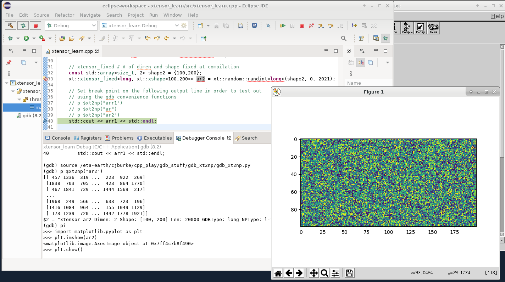

# gdb_xt2np
GDB python tool to pretty print, examine, and debug c++ [Xtensor](https://xtensor.readthedocs.io/en/latest/) containers. Xtensor is a c++ library for scientific computing using multidimensional arrays while providing a very python numpy-esque interface. Using the python GDB interface, this tool converts an xtensor to a numpy array and saves it to the GDB python interactive session allowing one to examine the xtensor array using matplotlib, printing numpy slices, etc..

Here is a screenshot of it in action where during a debugging session, in c++ I use xtensor to create a 2-d (100x200) array filled with uniformly random distributed integers. At a gdb breakpoint, I use numpy to pretty print the array and enter an interactive python session to show the array as an image using matplotlib.

